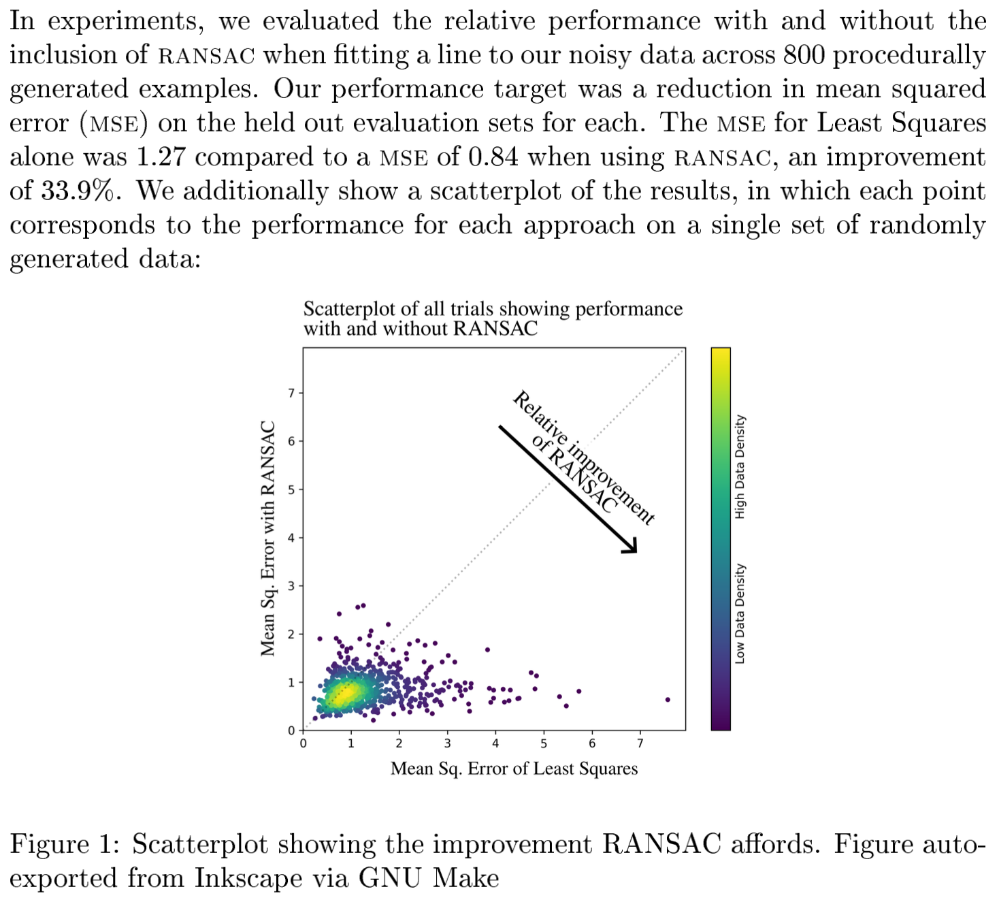
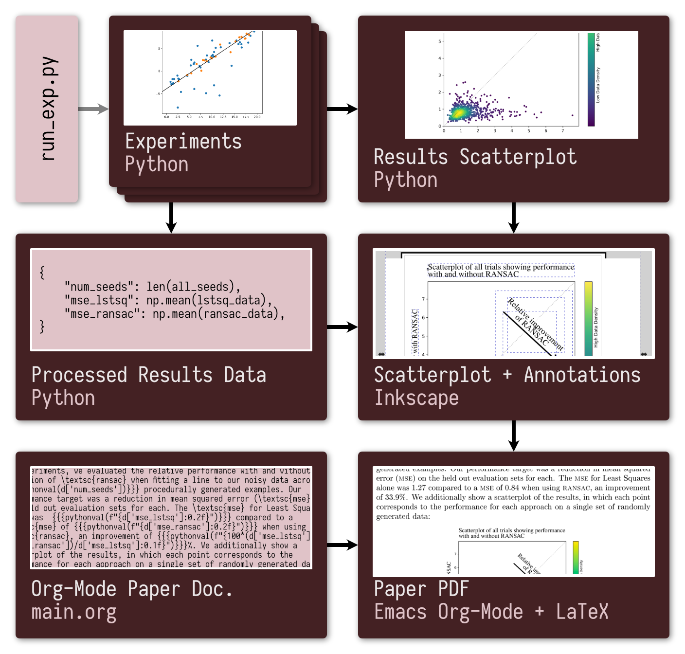

# PaperOps Demo
### Run experiments and add results to a PDF with a single Make command

The goal of this project is to demonstrate a simple proof-of-concept in which *every aspect* of running results to including them in a paper is automated. Simply download the repo from GitHub, run `make paper`, and it outputs a PDF file with the results from some simple experiments.

Running this command runs 800 simple "experiments" and includes the resulting scatterplot and statistics in the PDF compliled via LaTeX:
``` bash
make paper NUM_EXPERIMENTS=800 -j20
```
The resulting PDF resembles the following:

<p align="center">

</p>


The following schematic of the dependency structure of the Makefile and so an overview of the outputs generated automatically to build the PDF of the paper:

<p align="center">

</p>

See our [blog post](https://cs.gmu.edu/~gjstein/2024/5/paperops-demo/) for more details on how it works.
